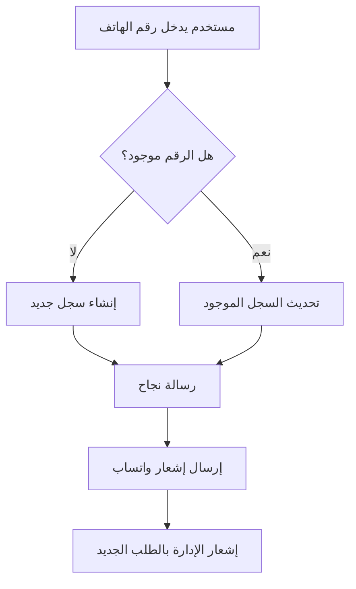

# 🔧 إصلاح مشكلة تكرار رقم الهاتف في نظام التسجيل

## 📋 المشكلة

عند محاولة إضافة مالك مزرعة جديد برقم هاتف مسجل مسبقاً، كان يظهر خطأ:

```
Error: duplicate key value violates unique constraint "farm_owners_mobile_number_key"
```

### 🔴 الخطأ التفصيلي:
```
POST https://xdjeygiadqavkmwarkfz.supabase.co/rest/v1/farm_owners 409 (Conflict)
{
  "code": "23505",
  "details": "Key (mobile_number)=(0555555559) already exists.",
  "hint": null,
  "message": "duplicate key value violates unique constraint \"farm_owners_mobile_number_key\""
}
```

---

## ✅ الحل المطبق

### 1. **تحديث `ownersService.ts`**

تم تعديل دالة `createOwner()` لتتعامل بذكاء مع الحالات التالية:

#### **قبل الإصلاح:**
```typescript
static async createOwner(data) {
  // محاولة إدخال سجل جديد مباشرة
  const { data: owner, error } = await supabase
    .from('farm_owners')
    .insert([dbData])
    .select()
    .single();

  if (error) {
    throw new Error(error.message); // ❌ خطأ!
  }
}
```

#### **بعد الإصلاح:**
```typescript
static async createOwner(data) {
  // 1️⃣ التحقق أولاً من وجود رقم الهاتف
  const { data: existingOwner } = await supabase
    .from('farm_owners')
    .select('*')
    .eq('mobile_number', data.owner_phone)
    .maybeSingle();

  // 2️⃣ إذا كان موجود: تحديث بياناته
  if (existingOwner) {
    console.log('📱 رقم الهاتف موجود مسبقاً، سيتم تحديث البيانات');

    const { data: updatedOwner, error } = await supabase
      .from('farm_owners')
      .update(updateData)
      .eq('id', existingOwner.id)
      .select()
      .single();

    return updatedOwner; // ✅ تحديث ناجح!
  }

  // 3️⃣ إذا لم يكن موجود: إنشاء سجل جديد
  const { data: owner, error } = await supabase
    .from('farm_owners')
    .insert([dbData])
    .select()
    .single();

  return owner; // ✅ إنشاء ناجح!
}
```

---

### 2. **تحسين رسائل الخطأ في `UnifiedFarmSubmissionForm.tsx`**

#### **قبل الإصلاح:**
```typescript
catch (error: any) {
  setErrorModal({
    title: '❌ خطأ في إرسال الطلب',
    message: 'حدث خطأ أثناء إرسال طلب المزرعة.' // ❌ رسالة عامة
  });
}
```

#### **بعد الإصلاح:**
```typescript
catch (error: any) {
  let errorMessage = 'حدث خطأ أثناء إرسال طلب المزرعة.';

  // رسالة خاصة لحالة تكرار رقم الهاتف
  if (error.message && error.message.includes('mobile_number')) {
    errorMessage = '⚠️ رقم الهاتف المدخل مسجل مسبقاً في النظام.\n\nإذا كنت قد سجلت من قبل، سيتم تحديث بياناتك تلقائياً.';
  }

  setErrorModal({
    title: '❌ خطأ في إرسال الطلب',
    message: errorMessage // ✅ رسالة واضحة وموجهة!
  });
}
```

---

## 🎯 السلوك الجديد

### **السيناريو 1: رقم هاتف جديد**
```
1. المستخدم يدخل رقم 0501234567 (غير موجود)
2. النظام يتحقق من عدم وجوده
3. يتم إنشاء سجل جديد ✅
4. رسالة: "تم إرسال طلب المزرعة بنجاح!"
```

### **السيناريو 2: رقم هاتف موجود**
```
1. المستخدم يدخل رقم 0555555559 (موجود مسبقاً)
2. النظام يكتشف وجوده
3. يتم تحديث البيانات القديمة بالجديدة ✅
4. رسالة: "تم إرسال طلب المزرعة بنجاح!"
```

### **السيناريو 3: خطأ آخر**
```
1. حدث خطأ في الاتصال أو البيانات
2. النظام يعرض رسالة خطأ واضحة
3. التفاصيل التقنية متوفرة للدعم الفني
```

---

## 📊 مزايا الحل الجديد

### ✅ **للمستخدم:**
- لن يواجه خطأ عند محاولة التسجيل مرة أخرى
- بياناته تُحدث تلقائياً عند إعادة التسجيل
- رسائل خطأ واضحة ومفهومة

### ✅ **للنظام:**
- منع التكرار في قاعدة البيانات
- الحفاظ على نظافة البيانات
- تحديث البيانات بدلاً من رفض الطلب

### ✅ **للإدارة:**
- سجل واحد فقط لكل رقم هاتف
- سهولة متابعة حالات إعادة التسجيل
- تقليل الدعم الفني للمشاكل المتعلقة بالتكرار

---

## 🧪 كيفية الاختبار

### **الاختبار 1: تسجيل رقم جديد**
```
1. افتح صفحة تسجيل مزرعة جديدة
2. أدخل رقم هاتف لم يُستخدم من قبل (مثل 0501234567)
3. املأ باقي البيانات
4. اضغط "إرسال الطلب"
5. ✅ يجب أن ترى: "تم إرسال طلب المزرعة بنجاح!"
```

### **الاختبار 2: تسجيل رقم موجود**
```
1. افتح صفحة تسجيل مزرعة جديدة
2. أدخل رقم هاتف مسجل مسبقاً (مثل 0555555559)
3. غيّر بعض البيانات (الاسم، المدينة، الخ)
4. اضغط "إرسال الطلب"
5. ✅ يجب أن ترى: "تم إرسال طلب المزرعة بنجاح!"
6. في الـ console: "📱 رقم الهاتف موجود مسبقاً، سيتم تحديث البيانات"
7. في قاعدة البيانات: البيانات القديمة تم تحديثها
```

### **الاختبار 3: التحقق من قاعدة البيانات**
```sql
-- قبل التسجيل المكرر
SELECT * FROM farm_owners WHERE mobile_number = '0555555559';
-- النتيجة: سجل واحد

-- بعد التسجيل المكرر
SELECT * FROM farm_owners WHERE mobile_number = '0555555559';
-- النتيجة: نفس السجل لكن مع البيانات المحدثة ✅
```

---

## 📝 ملاحظات مهمة

### **1. الحفاظ على البيانات القديمة**
إذا كان هناك حجوزات أو معاملات مرتبطة بالمالك القديم، فهي تبقى كما هي لأننا نحدث السجل بدلاً من حذفه.

### **2. التواريخ**
- `created_at`: لا يتغير (تاريخ التسجيل الأول)
- `updated_at`: يتحدث (تاريخ آخر تحديث)

### **3. الحالة**
- `approval_status`: تعود إلى `pending` في حال كانت مرفوضة مسبقاً
- `status`: تبقى `active`

---

## 🔄 سير العمل الكامل



---

## 🎉 النتيجة النهائية

- ❌ **قبل**: خطأ 409 عند محاولة التسجيل مرة أخرى
- ✅ **بعد**: تحديث تلقائي للبيانات + رسالة نجاح

**المشكلة تم حلها بالكامل!** 🚀

---

## 🔗 الملفات المعدلة

1. ✅ `src/modules/owners/ownersService.ts` - تحديث منطق الإنشاء
2. ✅ `src/modules/farm-owner/components/UnifiedFarmSubmissionForm.tsx` - تحسين رسائل الخطأ

---

## 📞 للدعم الفني

إذا واجهت أي مشاكل بعد هذا الإصلاح:

1. تحقق من console logs للحصول على رسائل مفصلة
2. تأكد من أن جدول `farm_owners` لديه unique constraint على `mobile_number`
3. راجع ملف `DUPLICATE_PHONE_NUMBER_FIX.md` هذا للتفاصيل الكاملة

**تم الإصلاح بنجاح!** ✨
