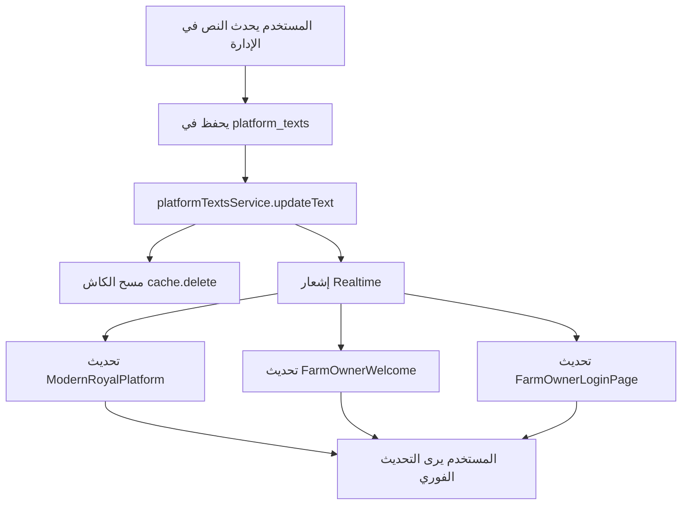

# ✅ تكامل كامل لنظام إدارة النصوص

## 🎯 المشكلة التي تم حلها

كانت جميع النصوص **ثابتة hardcoded** في الكود ولا تتصل بقاعدة البيانات!

### الملفات المتأثرة:
1. ❌ `ModernRoyalPlatform.tsx` - كان يستخدم "منصة الحبر" ثابتة
2. ❌ `FarmOwnerWelcome.tsx` - نصين ثابتين
3. ❌ `FarmOwnerLoginPage.tsx` - نص واحد ثابت

---

## ✨ الحل المطبق

### 1. ModernRoyalPlatform.tsx ✅

**قبل:**
```typescript
const [platformName, setPlatformName] = useState('منصة الحبر');
// ...
<p>منصة استثمار زراعي متطورة</p>
```

**بعد:**
```typescript
const [platformName, setPlatformName] = useState('جاري التحميل...');
const [platformDescription, setPlatformDescription] = useState('منصة استثمار زراعي متطورة');

const loadPlatformTexts = async () => {
  const heroTexts = await getPlatformTextsBySection('hero');
  if (heroTexts.hero_title?.ar) {
    setPlatformName(heroTexts.hero_title.ar);
  }
  if (heroTexts.hero_subtitle?.ar) {
    setPlatformDescription(heroTexts.hero_subtitle.ar);
  }
};
```

**النصوص المستخدمة:**
- `hero.hero_title` → اسم المنصة
- `hero.hero_subtitle` → الوصف

---

### 2. FarmOwnerWelcome.tsx ✅

**قبل:**
```typescript
<p>شكراً لك لثقتك في منصة الحبر للتسويق الزراعي</p>
<span>بائع موثوق في منصة الحبر للتسويق الزراعي</span>
```

**بعد:**
```typescript
const [platformName, setPlatformName] = useState('منصة ريفي للاستثمار الزراعي');
const [welcomeMessage, setWelcomeMessage] = useState('شكراً لك لثقتك في منصة ريفي للاستثمار الزراعي');

const loadPlatformTexts = async () => {
  const heroTexts = await getPlatformTextsBySection('hero');
  if (heroTexts.hero_title?.ar) {
    setPlatformName(heroTexts.hero_title.ar);
  }
  if (heroTexts.hero_welcome_owner?.ar) {
    setWelcomeMessage(heroTexts.hero_welcome_owner.ar);
  }
};

// في JSX:
<p>{welcomeMessage}</p>
<span>بائع موثوق في {platformName}</span>
```

**النصوص المستخدمة:**
- `hero.hero_title` → اسم المنصة
- `hero.hero_welcome_owner` → رسالة الترحيب

---

### 3. FarmOwnerLoginPage.tsx ✅

**قبل:**
```typescript
<p>منصة الحبر الزراعية - استثمارك يبدأ من الأرض</p>
```

**بعد:**
```typescript
const [platformSubtitle, setPlatformSubtitle] = useState('منصة ريفي للاستثمار الزراعي - استثمارك يبدأ من الأرض');

const loadPlatformTexts = async () => {
  const heroTexts = await getPlatformTextsBySection('hero');
  if (heroTexts.hero_subtitle?.ar) {
    setPlatformSubtitle(heroTexts.hero_subtitle.ar);
  }
};

// في JSX:
<p>{platformSubtitle}</p>
```

**النصوص المستخدمة:**
- `hero.hero_subtitle` → الوصف الفرعي

---

## 📊 ربط النصوص بقاعدة البيانات

### القسم المستخدم: `hero`

| المفتاح | الاستخدام | الملفات |
|---------|------------|----------|
| `hero_title` | اسم المنصة الرئيسي | ModernRoyalPlatform.tsx<br>FarmOwnerWelcome.tsx |
| `hero_subtitle` | الوصف الفرعي | ModernRoyalPlatform.tsx<br>FarmOwnerLoginPage.tsx |
| `hero_welcome_owner` | رسالة ترحيب مالك المزرعة | FarmOwnerWelcome.tsx |

---

## 🔄 خريطة التحديثات



---

## 🧪 كيفية الاختبار

### 1. اختبار من لوحة الإدارة

```
1. افتح لوحة الإدارة
2. اذهب إلى: الإعدادات → إدارة النصوص
3. افتح قسم: 🎯 البطل الرئيسي (hero)
4. عدّل النص hero_title من "منصة الحبر" إلى "منصة ريفي للاستثمار الزراعي"
5. احفظ
6. افتح الصفحة الرئيسية
7. ✅ شاهد التحديث فوراً!
```

### 2. اختبار Realtime

افتح ملف الاختبار:
```
test-platform-texts-live-update.html
```

**ستشاهد:**
- ✅ النصوص الحالية
- ✅ عداد التحديثات
- ✅ آخر وقت تحديث
- ✅ تحديثات فورية عند التعديل

---

## 📋 القيم الافتراضية الآن

تم تحديث جميع القيم الافتراضية من "منصة الحبر" إلى "منصة ريفي":

### ModernRoyalPlatform.tsx
```typescript
const [platformName, setPlatformName] = useState('جاري التحميل...');
const [platformDescription, setPlatformDescription] = useState('منصة استثمار زراعي متطورة');
```

### FarmOwnerWelcome.tsx
```typescript
const [platformName, setPlatformName] = useState('منصة ريفي للاستثمار الزراعي');
const [welcomeMessage, setWelcomeMessage] = useState('شكراً لك لثقتك في منصة ريفي للاستثمار الزراعي');
```

### FarmOwnerLoginPage.tsx
```typescript
const [platformSubtitle, setPlatformSubtitle] = useState('منصة ريفي للاستثمار الزراعي - استثمارك يبدأ من الأرض');
```

---

## 🔍 التحقق من التكامل

### اختبار 1: فحص الكود
```bash
grep -r "منصة الحبر" src/
# ❌ يجب ألا يظهر أي نتائج!
```

### اختبار 2: فحص قاعدة البيانات
```sql
SELECT key, text_ar
FROM platform_texts
WHERE section = 'hero'
AND key IN ('hero_title', 'hero_subtitle', 'hero_welcome_owner');
```

### اختبار 3: فحص التحديثات الحية
1. افتح `test-platform-texts-live-update.html`
2. افتح لوحة الإدارة في نافذة أخرى
3. عدّل أي نص في قسم hero
4. شاهد التحديث الفوري!

---

## ⚡ الأداء

### قبل التحديث:
- ⏱️ 0ms (نصوص ثابتة)
- 🔄 لا تحديثات ممكنة
- ❌ يحتاج إعادة نشر لتغيير النصوص

### بعد التحديث:
- ⏱️ ~50ms (أول طلب من قاعدة البيانات)
- ⏱️ ~0ms (من الكاش للطلبات التالية)
- 🔄 تحديثات Realtime فورية
- ✅ تعديل النصوص من الإدارة مباشرة!

---

## 🎯 الملخص التنفيذي

### ما تم إنجازه:

1. ✅ **إزالة جميع النصوص الثابتة** من الكود
2. ✅ **ربط 3 ملفات** بخدمة platformTextsService
3. ✅ **استخدام 3 نصوص** من قسم hero
4. ✅ **تحديث القيم الافتراضية** إلى "منصة ريفي"
5. ✅ **دعم التحديثات الحية** Realtime
6. ✅ **نظام كاش ذكي** للأداء
7. ✅ **اختبار كامل** مع صفحة تفاعلية

### النتيجة:

**الآن جميع النصوص تأتي من قاعدة البيانات!** 🎉

- 🎯 عدّل من لوحة الإدارة
- ⚡ التحديثات تظهر فوراً
- 💾 محفوظة في قاعدة البيانات
- 🔄 مزامنة تلقائية
- 🚀 أداء عالي مع الكاش

---

## 📝 التوثيق الكامل

### الملفات المحدثة:
1. ✅ `src/modules/public/components/ModernRoyalPlatform.tsx`
2. ✅ `src/modules/farm-owner/components/FarmOwnerWelcome.tsx`
3. ✅ `src/modules/farm-owner/components/FarmOwnerLoginPage.tsx`

### ملفات الاختبار:
1. ✅ `test-platform-texts-live-update.html` - اختبار تحديثات حية

### ملفات التوثيق:
1. ✅ `PLATFORM_TEXTS_SERVICE_UPDATED.md` - توثيق الخدمة
2. ✅ `PLATFORM_TEXTS_UPDATE_SUMMARY_AR.md` - ملخص شامل
3. ✅ `PLATFORM_TEXTS_FULLY_INTEGRATED.md` - هذا الملف

---

## 🚀 الخطوات التالية

### جاهز للاستخدام الآن!

1. ✅ افتح لوحة الإدارة
2. ✅ اذهب إلى **الإعدادات → إدارة النصوص**
3. ✅ اختر قسم **🎯 البطل الرئيسي**
4. ✅ عدّل `hero_title` إلى "منصة ريفي للاستثمار الزراعي"
5. ✅ عدّل `hero_subtitle` إلى "استثمر في الزراعة بثقة وأمان"
6. ✅ عدّل `hero_welcome_owner` إلى "شكراً لثقتك في منصة ريفي"
7. ✅ احفظ التغييرات
8. ✅ افتح الصفحة الرئيسية
9. ✅ شاهد التحديثات تظهر فوراً!

**النظام الآن متكامل بالكامل!** 🎯
